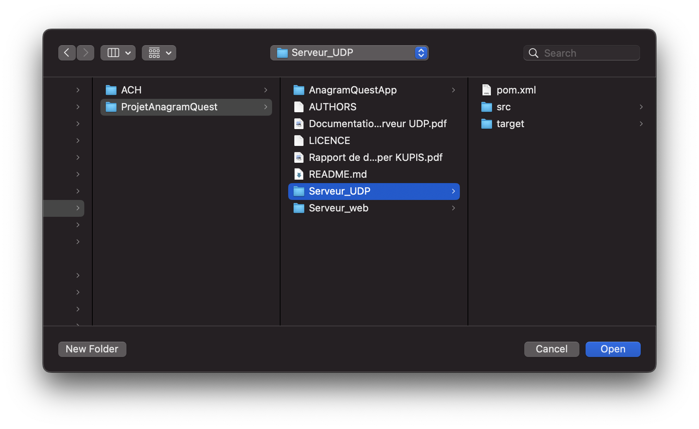
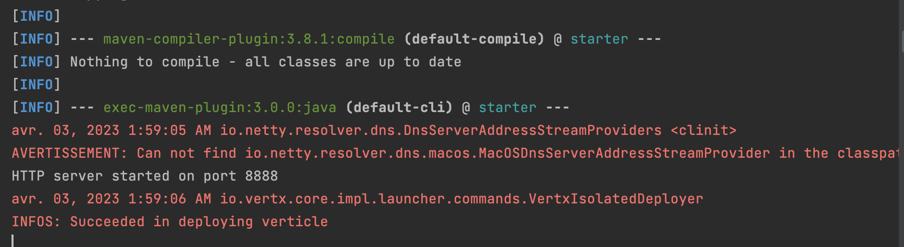

# ProjetAnagramQuest
Projet Anagram Quest du cours Java Réseau

# Serveur UDP 

Ouvrez le fichier "Serveur_UDP" dans IntelliJ : 



Une bannière bleue pourrait apparaître si vous n'avez pas la version 18 de JDK (voir ci-dessous). Il est préférable de la télécharger afin de ne pas rencontrer d'erreurs. 


Cliquez sur le fichier Serveur_UDP


Cliquez sur l'icone verte "RUN":


Un terminal va s'ouvrir en bas de l'application. Lorsqu'aucun paquet n'est reçu, un message d'erreur sera affiché en rouge, comme ci-dessous. 

Sinon vous pouvez envoyer un message à partir d'un nouveau terminal. 

Pour cela, entrez la commande suivante : 

```sh
nc -u localhost 20000
```

Puis écrivez le message que vous souhaitez envoyer à l'application. Une liste des commandes valides est disponible en PDF [ici](Documentation_Serveur_UDP.pdf)


# Serveur Web (VertX)

Commencez par ouvrir le projet dans IntelliJ, puis cliquez sur le fichier MainVerticle : 


A droite de l'application se trouve un onglet "Maven". Cliquez dessus


Puis cliquez sur l'icone "Execute Maven Goal" : 


Il faudra chercher la commande suvante dans la fenêtre qui s'affiche : 

```java
mvn compile exec:java
```


Un terminal s'ouvre alors et affichie "INFO: Succeeded in deploying verticle" si tout s'est executé correctement : 



Vous pouvez alors utiliser le serveur web en ecrivant l'adresse suivante dans un navigateur : 

```sh
localhost:8888
```

La page suivante devrait alors s'afficher :


# Application Android 

Pour lancer l'application Android, il faut tout d'abord lancer Android Studio puis :
1. soit créer un émulateur dans Device Manager


2. soit connecter votre téléphone à votre PC après avoir activé le débogage usb


Puis séléctionner l'appareil (émulateur ou votre téléphone) en haut à gauche puis lancer l'application avec l'icone run verte.


